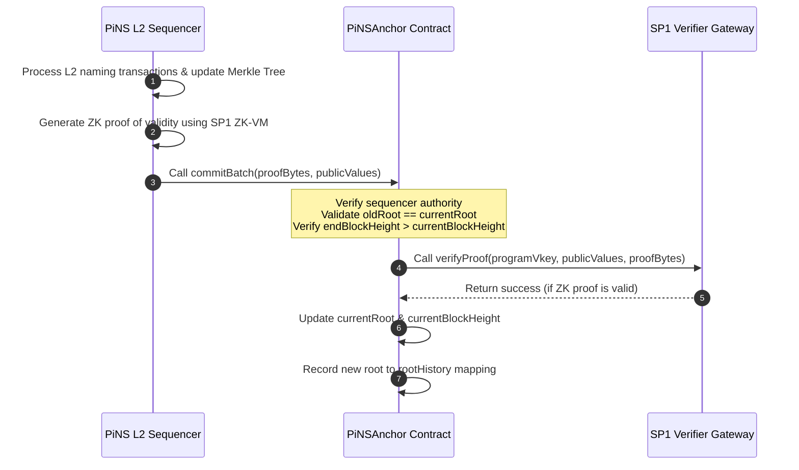

# PiNS EVM Anchor

The EVM-compatible state anchor for the **PIVX Name Service (PiNS)**. This repository contains the Solidity smart contracts responsible for verifying and recording the state roots of the PiNS Layer-2 naming registry on EVM-based blockchains using [Succinct's](https://succinct.xyz) [SP1 ZK-VM](https://docs.succinct.xyz).

---

## 1. What is this contract for?

### PIVX Name Service (PiNS)
The [PIVX Name Service (PiNS)](https://pivx.name) is a decentralized naming system designed for the [PIVX](https://pivx.org) cryptocurrency ecosystem. It allows users to register human-readable names (e.g., `richard.pivx`) and link them to secure, shielded PIVX addresses (which typically begin with `ps1`), public keys, or arbitrary metadata.

### The Role of the EVM Anchor
Because PIVX is a privacy-centric UTXO-based blockchain, reading name records directly inside EVM smart contracts would normally require running an expensive on-chain light client. 

To bridge this gap, the `PiNSAnchor` contract acts as a Layer-2 state anchor on any EVM-compatible network. The PiNS Layer-2 sequencer periodically commits the cryptographic roots of the name registry to this contract. This enables external EVM dApps to **trustlessly verify name ownership, resolve names, and check metadata** via simple Merkle inclusion proofs against the historically verified state roots.

---

## 2. Contract Files

*   **[PiNSAnchor.sol](PiNSAnchor.sol)**: The production contract deployed on mainnets. It performs full cryptographic verification of zero-knowledge validity proofs by calling the official [Succinct](https://succinct.xyz) verifier gateway.
*   **[MockPiNSAnchor.sol](MockPiNSAnchor.sol)**: A mock implementation designed for local testing and TestNet deployments. It bypasses SP1 ZK-SNARK verification to allow fast integration testing with mock proofs without requiring a live verifier setup.

---

## 3. How it works

The state of the PiNS registry is represented by a **Sparse Merkle Tree (SMT)**, where the root of the tree uniquely reflects the entire registry database. The progression of this state is verified on-chain via ZK-Rollup mechanics.

### Proof Confirmation Workflow



1. **L2 Batching**: The PiNS Layer-2 sequencer collects name registrations, transfers, or updates and updates the local Sparse Merkle Tree, transitioning it from `oldRoot` to `newRoot`.
2. **ZK Proof Generation**: The sequencer runs the state transition program inside [Succinct's](https://succinct.xyz) [SP1 ZK-VM](https://docs.succinct.xyz) (a Rust-based zero-knowledge virtual machine). The ZK-VM program verifies that all transactions are valid (e.g., signatures match, names are not registered twice, registration fees are valid). The SP1 host generates a ZK validity proof (`proofBytes`).
3. **Commitment Submission**: The sequencer submits the batch by calling `commitBatch(proofBytes, publicValues)` on the `PiNSAnchor` contract. The `publicValues` payload is an ABI-encoded tuple consisting of:
   - `oldRoot` (32 bytes)
   - `newRoot` (32 bytes)
   - `endBlockHeight` (32 bytes representing the PIVX block height)
4. **On-Chain Verification**:
   - The contract verifies that the caller is the authorized `sequencer`.
   - It performs continuity checks: the submitted `oldRoot` must match the stored `currentRoot`, and the `endBlockHeight` must be greater than the stored `currentBlockHeight`.
   - It forwards the ZK proof (`proofBytes`), verification key (`programVkey`), and the public parameters (`publicValues`) to the [Succinct](https://succinct.xyz) gateway (`ISP1Verifier`).
5. **State Update**: If the SP1 gateway cryptographically confirms the proof is valid, the contract updates `currentRoot` to `newRoot`, advances `currentBlockHeight` to `endBlockHeight`, and saves the root inside `rootHistory`.

---

## 4. How a trustless system is achieved

The `PiNSAnchor` narrows what the sequencer can do, but the guarantee is **fraud-evident, not fraud-preventing** — see [Trust & Privacy](https://docs.pivx.name/trust-and-privacy) before relying on any stronger reading. The proof constrains the *transition rules*; what makes the *inputs* honest is public replication: the registrar publishes its protocol address and viewing key, so anyone can replay the chain through the open-source indexer and contradict a bad root. A bad batch can land on-chain and be disproved afterwards; recovery is social, not automatic.

Within that model, the contract provides:

* **Zero-Knowledge Validity Proofs**: Unlike optimistic systems that assume updates are valid until proven otherwise (requiring challenge periods), PiNS uses ZK-SNARKs. It is mathematically impossible to update the state root on the EVM anchor without submitting a valid ZK proof. The on-chain verifier provided by [Succinct](https://succinct.xyz) guarantees that all protocol rules were strictly followed.
* **Strict State Transition Chains**: The contract enforces `oldRoot == currentRoot`. The sequencer cannot skip blocks, replay old batches, or update the root out-of-order, maintaining absolute chronological consistency.
* **Immutable Verification Rules**: The ZK proof verification relies on the `programVkey` (the cryptographic hash of the compiled Rust validation program). Even if the sequencer wallet is compromised, the attacker **cannot forge name updates or steal domains** because they cannot generate a valid ZK proof that violates the compiled Rust program's rules. Changing that key is a two-party action (below), so a compromised sequencer cannot swap in rules of its own either.
* **Trustless Querying (Historical Roots)**: The contract stores a historical record of all verified roots in the `rootHistory` mapping. Any dApp or user can call `verifyRootValidity(root)` to verify if a Merkle root was officially confirmed. External applications can perform lookup resolutions trustlessly by submitting Merkle inclusion proofs against any root stored in the history.

---

## 5. Administrative controls

No single key can change the protocol's rules. The two settings that decide what the
contract will accept are split across **two distinct parties**: the sequencer proposes and
the owner approves. The constructor enforces that they are different addresses.

| Flow | Proposed by | Applied by | Rejected by |
|:---|:---|:---|:---|
| Program upgrade (`programVkey`) | sequencer | owner, restating the value | owner |
| Root rollback | sequencer | owner, restating the value, **while paused** | owner |

Both approvals require the caller to name the exact value they are approving, so a
sequencer cannot swap the proposal between the owner inspecting it and the approval
landing. Every step emits an event — proposed, applied, rejected — and each carries the
address that caused it, so the full authorisation trail of a privileged change is
reconstructible from logs alone.

**Rotating the sequencer discards whatever it left pending.** The usual reason to rotate
that key is that it was lost or compromised, and a proposal made by the key being revoked
must not stay approvable afterwards.

**Rollback is deliberately constrained.** The target must be a root this contract already
accepted, and its block height is read from that record rather than supplied by the
caller — so a rollback can only ever move the chain to a state it previously attested to.
It can never return to the empty tree.

**A rollback repudiates what it undoes.** Every root committed after the target is struck
from `rootHistory` and emits `RootInvalidated`, so `isRootValid()` returns `false` for it
from that point on — permanently, even once the chain is rebuilt past the same heights.
This matters if you integrate against the anchor: a rollback exists to disavow a defective
state, and a Merkle proof against a disavowed root must stop verifying. Re-check
`isRootValid()` rather than caching a past `true`.

Ownership transfer is two-step and withdrawable from both sides: the owner can cancel an
outstanding offer, and the nominee can decline it.

Batch processing can be halted with `pause()` for emergencies; rollback approval requires
the paused state, so recovery cannot race an in-flight commit.

---

## 6. Tests

A state-machine suite runs the contract against an in-process EVM, so no chain, funded
wallet or SP1 prover is needed. It exercises the batch invariants, both two-step flows,
the event authorisation trail, and genesis from an empty tree.

```bash
cd test && npm install && npm test
```

---

## 7. Build artifacts

The compiled ABI and bytecode are committed beside the sources:

| File | Purpose |
|:---|:---|
| `PiNSAnchor_sol_PiNSAnchor.abi` | Consumed by the indexer to decode `RootUpdated` logs |
| `PiNSAnchor_sol_PiNSAnchor.bin` | Deployment bytecode |
| `PiNSAnchor_sol_ISP1Verifier.abi` | The verifier interface |
| `MockPiNSAnchor_sol_MockPiNSAnchor.*` | Test-only build — **never deploy this**, it bypasses proof verification entirely |

Regenerate them after **any** change to the sources, including comment-only edits — solc
embeds a metadata hash of the source in the bytecode, so the `.bin` changes even when the
logic does not:

```bash
cd test && npm install && node compile.js
```

Then copy `abi` and `evm.bytecode.object` out of `test/artifacts.json` for each contract.
Keep the indexer's copy in step: a stale ABI silently omits newly added events.
