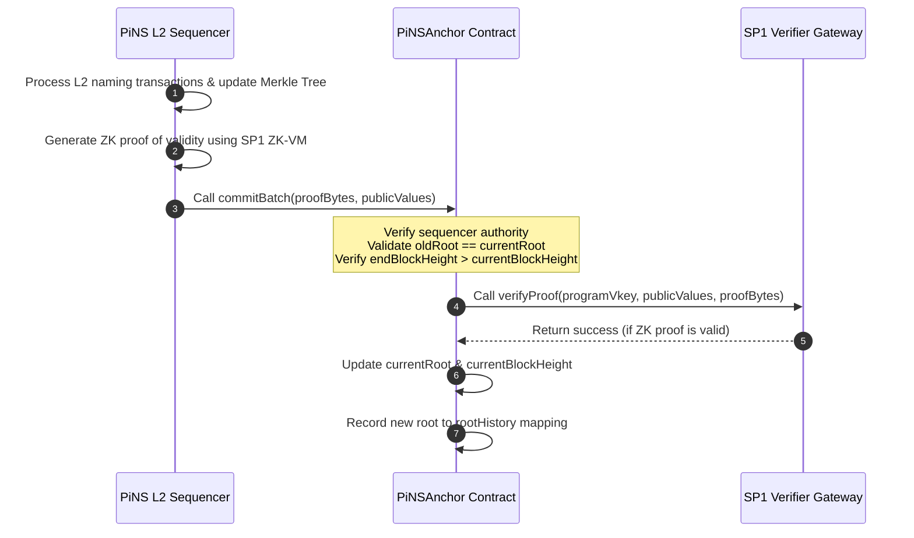

# PiNS EVM Anchor

The EVM-compatible state anchor for the **PIVX Name Service (PiNS)**. This repository contains the Solidity smart contracts responsible for verifying and recording the state roots of the PiNS Layer-2 naming registry on EVM-based blockchains using [Succinct's](https://succinct.xyz) [SP1 ZK-VM](https://docs.succinct.xyz).

---

## 1. What is this contract for?

### PIVX Name Service (PiNS)
The [PIVX Name Service (PiNS)](https://pivx.name) is a decentralized naming system designed for the [PIVX](https://pivx.org) cryptocurrency ecosystem. It allows users to register human-readable names (e.g., `richard.pivx`) and link them to secure, shielded PIVX addresses (which typically begin with `ps1`), public keys, or arbitrary metadata.

### The Role of the EVM Anchor
Because PIVX is a privacy-centric UTXO-based blockchain, reading name records directly inside EVM smart contracts would normally require running an expensive on-chain light client. 

To bridge this gap, the `PiNSAnchor` contract acts as a Layer-2 state anchor on EVM-compatible networks (such as Polygon, BSC, Arbitrum, or Ethereum). The PiNS Layer-2 sequencer periodically commits the cryptographic roots of the name registry to this contract. This enables external EVM dApps to **trustlessly verify name ownership, resolve names, and check metadata** via simple Merkle inclusion proofs against the historically verified state roots.

---

## 2. Contract Files

*   **[PiNSAnchor.sol](file:///home/alexey/myProjects/pivx/pivx-name/pivx-name-evm-anchor/PiNSAnchor.sol)**: The production contract deployed on mainnets. It performs full cryptographic verification of zero-knowledge validity proofs by calling the official [Succinct](https://succinct.xyz) verifier gateway.
*   **[MockPiNSAnchor.sol](file:///home/alexey/myProjects/pivx/pivx-name/pivx-name-evm-anchor/MockPiNSAnchor.sol)**: A mock implementation designed for local testing and TestNet deployments. It bypasses SP1 ZK-SNARK verification to allow fast integration testing with mock proofs without requiring a live verifier setup.

---

## 3. How it works

The state of the PiNS registry is represented by a **Sparse Merkle Tree (SMT)**, where the root of the tree uniquely reflects the entire registry database. The progression of this state is verified on-chain via ZK-Rollup mechanics.

### Proof Confirmation Workflow

1. **L2 Batching**: The PiNS Layer-2 sequencer collects name registrations, transfers, or updates and updates the local Sparse Merkle Tree, transitioning it from `oldRoot` to `newRoot`.
2. **ZK Proof Generation**: The sequencer runs the state transition program inside [Succinct's](https://succinct.xyz) [SP1 ZK-VM](https://docs.succinct.xyz) (a Rust-based zero-knowledge virtual machine). The ZK-VM program verifies that all transactions are valid (e.g., signatures match, names are not registered twice, registration fees are valid). The SP1 host generates a ZK validity proof (`proofBytes`).
3. **Commitment Submission**: The sequencer submits the batch by calling `commitBatch(proofBytes, publicValues)` on the `PiNSAnchor` contract. The `publicValues` payload is an ABI-encoded tuple consisting of:
   - `oldRoot` (32 bytes)
   - `newRoot` (32 bytes)
   - `endBlockHeight` (32 bytes representing the PIVX block height)
4. **On-Chain Verification**:
   - The contract verifies that the caller is the authorized `sequencer`.
   - It performs continuity checks: the submitted `oldRoot` must match the stored `currentRoot`, and the `endBlockHeight` must be greater than the stored `currentBlockHeight`.
   - It forwards the ZK proof (`proofBytes`), verification key (`programVkey`), and the public parameters (`publicValues`) to the [Succinct](https://succinct.xyz) gateway (`ISP1Verifier`).
5. **State Update**: If the SP1 gateway cryptographically confirms the proof is valid, the contract updates `currentRoot` to `newRoot`, advances `currentBlockHeight` to `endBlockHeight`, and saves the root inside `rootHistory`.

---

## 4. How a trustless system is achieved

The `PiNSAnchor` is designed to be completely trustless, eliminating the need for users to trust the sequencer or any third party:

* **Zero-Knowledge Validity Proofs**: Unlike optimistic systems that assume updates are valid until proven otherwise (requiring challenge periods), PiNS uses ZK-SNARKs. It is mathematically impossible to update the state root on the EVM anchor without submitting a valid ZK proof. The on-chain verifier provided by [Succinct](https://succinct.xyz) guarantees that all protocol rules were strictly followed.
* **Strict State Transition Chains**: The contract enforces `oldRoot == currentRoot`. The sequencer cannot skip blocks, replay old batches, or update the root out-of-order, maintaining absolute chronological consistency.
* **Immutable Verification Rules**: The ZK proof verification relies on the `programVkey` (the cryptographic hash of the compiled Rust validation program). Even if the sequencer wallet is compromised, the attacker **cannot forge name updates or steal domains** because they cannot generate a valid ZK proof that violates the compiled Rust program's rules.
* **Trustless Querying (Historical Roots)**: The contract stores a historical record of all verified roots in the `rootHistory` mapping. Any dApp or user can call `verifyRootValidity(root)` to verify if a Merkle root was officially confirmed. External applications can perform lookup resolutions trustlessly by submitting Merkle inclusion proofs against any root stored in the history.
