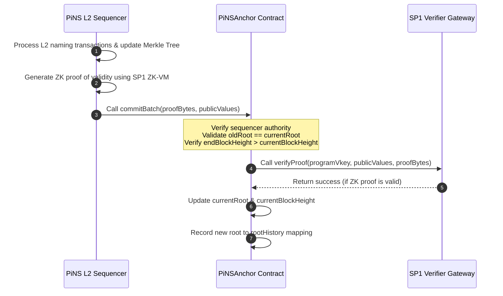

# PiNS EVM Anchor

The EVM-compatible state anchor for the **PIVX Name Service (PiNS)**. This repository contains the Solidity smart contracts responsible for verifying and recording the state roots of the PiNS Layer-2 naming registry on EVM-based blockchains using [Succinct's](https://succinct.xyz) [SP1 ZK-VM](https://docs.succinct.xyz).

---

## 1. What is this contract for?

### PIVX Name Service (PiNS)
The [PIVX Name Service (PiNS)](https://pivx.name) is a decentralized naming system designed for the [PIVX](https://pivx.org) cryptocurrency ecosystem. It allows users to register human-readable names (e.g., `richard.pivx`) and link them to secure, shielded PIVX addresses (which typically begin with `ps1`), public keys, or arbitrary metadata.

### The Role of the EVM Anchor
Because PIVX is a privacy-centric UTXO-based blockchain, reading name records directly inside EVM smart contracts would normally require running an expensive on-chain light client. 

To bridge this gap, the `PiNSAnchor` contract acts as a Layer-2 state anchor on any EVM-compatible network. The PiNS Layer-2 sequencer periodically commits the cryptographic roots of the name registry to this contract. This enables external EVM dApps to **trustlessly verify name ownership, resolve names, and check metadata** via simple Merkle inclusion proofs against the historically verified state roots.

---

## 2. Contract Files

*   **[PiNSAnchor.sol](PiNSAnchor.sol)**: The production contract deployed on mainnets. It performs full cryptographic verification of zero-knowledge validity proofs by calling the official [Succinct](https://succinct.xyz) verifier gateway.
*   **[MockPiNSAnchor.sol](MockPiNSAnchor.sol)**: A mock implementation designed for local testing and TestNet deployments. It bypasses SP1 ZK-SNARK verification to allow fast integration testing with mock proofs without requiring a live verifier setup.

---

## 3. How it works

The state of the PiNS registry is represented by a **Sparse Merkle Tree (SMT)**, where the root of the tree uniquely reflects the entire registry database. The progression of this state is verified on-chain via ZK-Rollup mechanics.

### Proof Confirmation Workflow



1. **L2 Batching**: The PiNS Layer-2 sequencer collects name registrations, transfers, or updates and updates the local Sparse Merkle Tree, transitioning it from `oldRoot` to `newRoot`.
2. **ZK Proof Generation**: The sequencer runs the state transition program inside [Succinct's](https://succinct.xyz) [SP1 ZK-VM](https://docs.succinct.xyz) (a Rust-based zero-knowledge virtual machine). The ZK-VM program verifies that every operation follows the protocol rules (e.g., each is signed by the name's own key, names are not registered twice, nonces only increase). Payments are not visible to the program; they are checked by public replay (§4). The SP1 host generates a ZK validity proof (`proofBytes`).
3. **Commitment Submission**: The sequencer submits the batch by calling `commitBatch(proofBytes, publicValues)` on the `PiNSAnchor` contract. The `publicValues` payload is an ABI-encoded tuple consisting of:
   - `oldRoot` (32 bytes)
   - `newRoot` (32 bytes)
   - `endBlockHeight` (32 bytes representing the PIVX block height)
4. **On-Chain Verification**:
   - The contract verifies that the caller is the authorized `sequencer` (or the owner, as a fallback sequencer - it still needs a valid proof).
   - It performs continuity checks: the submitted `oldRoot` must match the stored `currentRoot`, the `endBlockHeight` must be greater than the stored `currentBlockHeight`, and the `newRoot` must be neither zero nor a root already anchored.
   - It forwards the ZK proof (`proofBytes`), verification key (`programVkey`), and the public parameters (`publicValues`) to the [Succinct](https://succinct.xyz) gateway (`ISP1Verifier`).
5. **State Update**: If the SP1 gateway cryptographically confirms the proof is valid, the contract updates `currentRoot` to `newRoot`, advances `currentBlockHeight` to `endBlockHeight`, and saves the root inside `rootHistory`.

---

## 4. How a trustless system is achieved

The `PiNSAnchor` narrows what the sequencer can do, but the guarantee is **fraud-evident, not fraud-preventing** — see [Trust & Privacy](https://docs.pivx.name/trust-and-privacy) before relying on any stronger reading. The proof constrains the *transition rules*; what makes the *inputs* honest is public replication: the registrar publishes its protocol address and viewing key, so anyone can replay the chain through the open-source indexer and contradict a bad root. A bad batch can land on-chain and be disproved afterwards; recovery is social, not automatic.

Within that model, the contract provides:

* **Zero-Knowledge Validity Proofs**: Unlike optimistic systems that assume updates are valid until proven otherwise (requiring challenge periods), PiNS uses ZK-SNARKs. A batch cannot move the state root without a valid ZK proof, and the on-chain verifier provided by [Succinct](https://succinct.xyz) guarantees that every batch follows the rules the program encodes. The only other ways the root moves are a rollback and a change of the rules themselves - both advance `epoch` (below).
* **Strict State Transition Chains**: The contract enforces `oldRoot == currentRoot`. The sequencer cannot skip blocks, replay old batches, or update the root out-of-order, maintaining absolute chronological consistency.
* **Versioned, Announced Verification Rules**: The ZK proof verification relies on the `programVkey` (the cryptographic hash of the compiled Rust validation program) and the `sp1Verifier` that checks it. Even if the sequencer wallet is compromised, the attacker **cannot change where a name points without that name's signature**, because they cannot generate a valid ZK proof that violates the compiled Rust program's rules. (A name its owner has listed for sale can be taken by a `BUY`; whether that purchase was paid is checked by replay.) Changing either is a timelocked action that advances `epoch` (below), so new rules - honest or not - are announced in advance and reach a client only once that client accepts the new epoch.
* **Root History**: The contract stores a historical record of all verified roots in the `rootHistory` mapping. Any dApp or user can call `verifyRootValidity(root)` to check whether a Merkle root was officially confirmed - for instance, to tell an indexer that is merely behind from one serving a tree that never existed. **Resolve names against the current root only** (`anchoredState()`), never against an older one: a proof against a historical root shows what a name pointed to *then*, and accepting it lets anyone replay a superseded record - an address its owner has since changed, or the state before a sale.

---

## 5. Administrative controls

No key can change the protocol's rules without notice. The two settings that decide what
the contract will accept - the verifier and the program key - change together, through
one flow: the sequencer proposes, the owner approves, and the change can take effect only
after `rulesTimelock` (at least `MIN_RULES_TIMELOCK`, 7 days, fixed at deployment). After
that, anyone can activate it. The constructor enforces that sequencer and owner are
different addresses.

| Flow | Proposed by | Applied by | Rejected by |
|:---|:---|:---|:---|
| Rules change (`programVkey` + `sp1Verifier`) | sequencer | owner approves, restating both values; anyone activates after `rulesTimelock` | owner, until activated |
| Root rollback | sequencer | owner, restating the value, **while paused**; advances `epoch` | owner |

The two-key split alone does not protect clients: the owner appoints the sequencer, so
both halves can end up with one party. What protects them is the epoch. Every activated
rules change, and every rollback, increments `epoch`, which only ever goes up - changing
the rules and then changing them back is two new epochs, not a return to the old one.
Those are the only two ways the current root can move without a proof under rules a
client has already reviewed: new rules redefine what counts as proven, and a rollback
makes an older state current again, re-pointing every name changed since without its
owner's signature.

### For clients: pin the epoch

Read `anchoredState()`, which returns the current root, its PIVX height and the `epoch`
from one block, and refuse a root under any epoch you have not reviewed. A new program,
or a rollback, then reaches your users only through your own release; `EpochAdvanced` is
the one event to watch. For a rules change, the timelock is there so that release can
ship - accepting both the old and the new epoch - before the change activates, so honest
upgrades cause no downtime. A rollback is an emergency measure and takes effect at once;
pinned clients stop resolving names until they have reviewed it, which for the
emergencies a rollback exists for is the safe outcome. Comparing `programVkey()` and
`sp1Verifier()` against pinned values instead is **not** equivalent: it misses a change
that was made, used and reversed between two reads.

To review a new program, rebuild it reproducibly and check that it produces the proposed
key; `RulesChangeProposed` and `RulesChangeScheduled` announce it, with the activation
time. A rules change that changes nothing, or names a verifier with no code, is refused.

Both approvals require the caller to name the exact value they are approving, so a
sequencer cannot swap the proposal between the owner inspecting it and the approval
landing. Every step emits an event — proposed, approved, applied, rejected — and each carries the
address that caused it, so the full authorisation trail of a privileged change is
reconstructible from logs alone.

**Rotating the sequencer discards whatever it left pending**, including a rules change
the owner has already approved. The usual reason to rotate that key is that it was lost
or compromised, and a proposal made by the key being revoked must not stay approvable -
or activatable - afterwards.

**Rollback is deliberately constrained.** The target must be a root this contract already
accepted, and its block height is read from that record rather than supplied by the
caller — so a rollback can only ever move the chain to a state it previously attested to.
It can never return to the empty tree, and never target the current root.

**A rollback repudiates what it undoes.** Every root records its index in the chain, and
a root is valid only while the chain still holds it at that index. A rollback moves the
tip back to the target, so every root committed after it reads as invalid at once - and
stays invalid once the chain is rebuilt past the same indexes, since those now hold other
roots. `RootRolledBack` says how many batches were undone; which roots they were can be
read from the `RootUpdated` events that committed them. The cost is constant however deep
the rollback, so no rollback is too deep to fit in a block, and none has to be split.
This matters if you integrate against the anchor: a rollback exists to disavow a defective
state, and a Merkle proof against a disavowed root must stop verifying. Re-check
`isRootValid()` rather than caching a past `true`.

Ownership transfer is two-step and withdrawable from both sides: the owner can cancel an
outstanding offer, and the nominee can decline it.

Batch processing can be halted with `pause()` for emergencies; rollback approval requires
the paused state, so recovery cannot race an in-flight commit.

---

## 6. Tests

A state-machine suite runs the contract against an in-process EVM, so no chain, funded
wallet or SP1 prover is needed. It exercises the batch invariants, the timelocked rules
change and the rollback flow, the event authorisation trail, and genesis from an empty
tree. Every expected revert is asserted by its custom error name. Stand-in verifiers
(`test/TestVerifiers.sol`, test-only) drive the real contract through a rules change, to
show that an approved change alters nothing before it activates.

`test/fuzz.js` then drives seeded random sequences of commits (honest and malformed),
rollbacks, rules changes and sequencer rotations against a simple reference model, and
after every step compares the current root, tip, height, epoch and the validity of every
root ever seen. A mismatch prints the seed and step; set `FUZZ_SEEDS` and `FUZZ_STEPS` to
replay or to run longer.

```bash
cd test && npm install && npm test
```

---

## 7. Build artifacts

The compiled ABI and bytecode are committed beside the sources:

| File | Purpose |
|:---|:---|
| `PiNSAnchor_sol_PiNSAnchor.abi` | Consumed by the indexer to decode `RootUpdated` logs |
| `PiNSAnchor_sol_PiNSAnchor.bin` | Deployment bytecode |
| `PiNSAnchor_sol_ISP1Verifier.abi` | The verifier interface |
| `MockPiNSAnchor_sol_MockPiNSAnchor.*` | Test-only build — **never deploy this**, it bypasses proof verification entirely |

Regenerate them after **any** change to the sources, including comment-only edits — solc
embeds a metadata hash of the source in the bytecode, so the `.bin` changes even when the
logic does not:

```bash
cd test && npm install && node compile.js
```

Then copy `abi` and `evm.bytecode.object` out of `test/artifacts.json` for each contract.
Keep the indexer's copy in step: a stale ABI silently omits newly added events.
